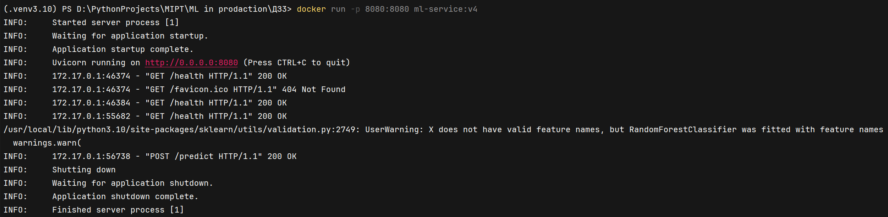
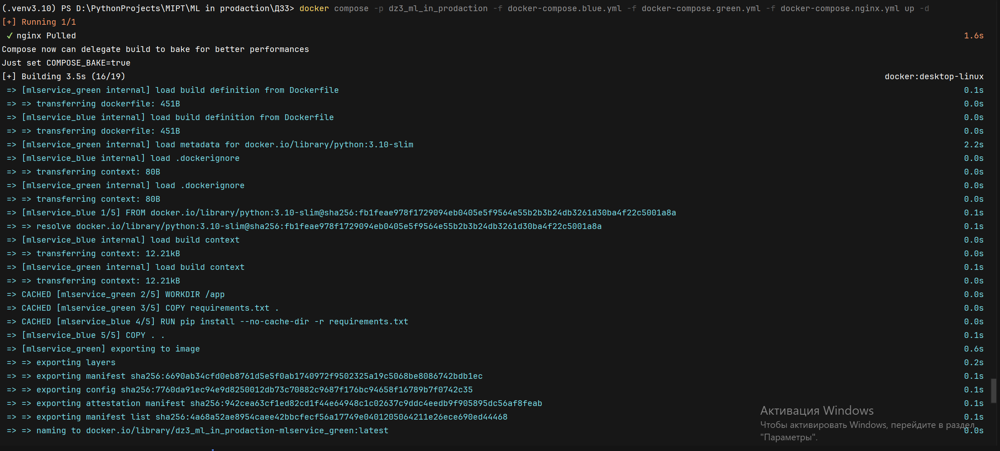
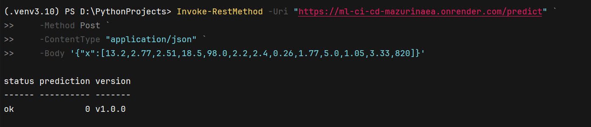

# MLOps HW3 — ml_ci_cd_MazurinaEA

## 📌 Краткое описание проекта
Проект реализует REST‑сервис для предсказаний на основе обученной ML‑модели (Wine dataset). Сервис предоставляет два метода:

  * Health — проверка состояния сервера и версии модели.
  * Predict — получение предсказания класса вина по 13 признакам.
  * Metrics — получение количества вызовов
  * Реализовано логирование эндпоинтов через logging, в терминале отслеживается
  * Метрики: количество вызовов эндпоинтов собирается через `prometheus_client.Counter`.

## 📂 Структура проекта

 ml_ci_cd_MazurinaEA/ # Репозиторий

 ├── app/
 
 │    └── main.py # Сервис

 ├── images/ # Картинки с работой сервиса

 ├── models/
 
 │    └── model.pkl # Обученная модель

 ├── .dockerignore # файл описания, что игнорировать

 ├── Dockerfile # Описание контейнера для сборки и запуска

 ├── README.md # Документация
 
 ├── docker-compose.blue.yml # Конфигурация Blue-версии сервиса
 
 ├── docker-compose.green.yml # Конфигурация Green-версии сервиса

 ├── docker-compose.nginx.yml # Конфигурация балансировщика Nginx между Blue и Green

 ├── nginx.conf # Настройки маршрутизации и проксирования Nginx
 
 ├── requirements.txt # Зависимостим
 
 └── ДЗ3.ipynb # Ноутбук с выполнением

## 🎯 Цель проекта
Задание выполняется в рамках модуля 3 «Автоматизированное развертывание с помощью CI/CD».
Научиться применять стратегии безопасного развертывания (Blue-Green и Canary) для ML-моделей и автоматизировать процесс деплоя через CI/CD (GitHub Actions).

После выполнения студент:

  * умеет использовать Docker и GitHub Actions для автоматического развертывания моделей;
  * реализует и тестирует стратегии деплоя;
  * контролирует версии моделей и умеет выполнять откат;
  * анализирует стабильность новой модели через /health и метрики.

## 🚀 Реализация стратегии развертывания
Для развертывания была выбрана Blue-Green Deployment.
для этого были написаны 2 docker-compose:

  - docker-compose.blue.yml
  - docker-compose.green.yml

Балансировщик nginx.
Для проверки работы надо:
  - клонировать репозиторий: git clone https://github.com/ElizavetaMaz/ml_ci_cd_MazurinaEA
  - перейти в репозиторий: cd ml_ci_cd_MazurinaEA
  - запустить docker-compose: docker compose -p dz3_ml_in_prodaction -f docker-compose.blue.yml -f docker-compose.green.yml -f docker-compose.nginx.yml up -d
  - перейти на:
    * http://localhost:8090/health - балансировщик
    * http://localhost:8080/health - blue-сервис
    * http://localhost:8081/health - green-сервис
   
Для проверки запущенного сервиса можно также ввести: curl http://localhost:8090/health     

## 🌐 Работа сервиса
Также сервис работает по адресу: https://ml-ci-cd-mazurinaea.onrender.com/health (нужно подождать пока загрузится, так как он отключается если нет никаких запросов)
Для проверки /predict:
  * PowerShell: Invoke-RestMethod -Uri "https://ml-ci-cd-mazurinaea.onrender.com/predict" `       
    -Method Post `
    -ContentType "application/json" `
    -Body '{"x":[13.2,2.77,2.51,18.5,98.0,2.2,2.4,0.26,1.77,5.0,1.05,3.33,820]}'
  * Bash: curl https://ml-ci-cd-mazurinaea.onrender.com/predict -d '{"x":[13.2,2.77,2.51,18.5,98.0,2.2,2.4,0.26,1.77,5.0,1.05,3.33,820]}'

## 📷 Фото работы

